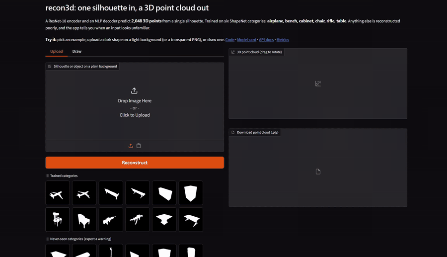
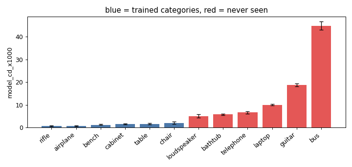
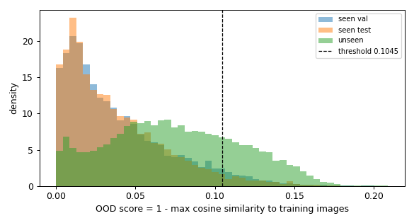
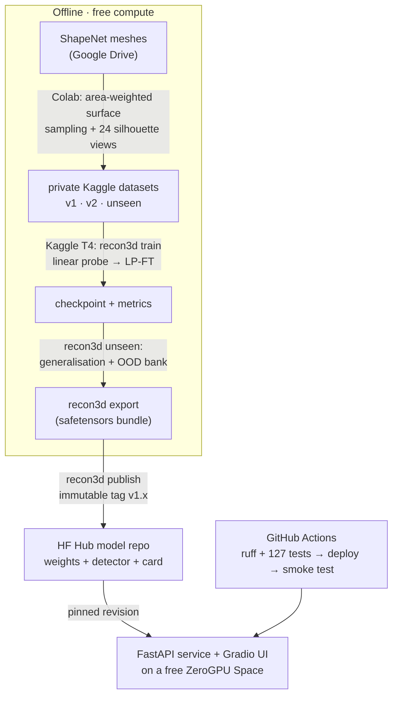

# recon3d — one silhouette in, a 3D point cloud out

[](https://github.com/Punithb2/recon3d/actions/workflows/ci.yml)
[](https://huggingface.co/spaces/Punith25/recon3d)
[](https://huggingface.co/Punith25/recon3d-resnet18)
[](pyproject.toml)

A ResNet-18 encoder and an MLP decoder predict **2,048 3D points** from a **single silhouette image**,
trained end to end with Chamfer distance on six ShapeNet categories — and served as a FastAPI + Gradio app
that warns the user when an upload looks unlike anything in the training set.

**[Live demo](https://huggingface.co/spaces/Punith25/recon3d)** · **[Model card](https://huggingface.co/Punith25/recon3d-resnet18)** · trained on a free Kaggle T4, deployed on a free Space.



## The problem

Recovering 3D shape from one image is ill-posed: a silhouette hides depth entirely, and infinitely many
solids project to the same outline. A model can only learn the shape *priors* of the categories it was
trained on. This project measures how far that gets you, how quickly it breaks on new categories, and
whether the service can notice when it is out of its depth.

## Results

Squared-L2 **Chamfer distance ×1000** (lower is better) and **F-score** at 1% / 2% of the bounding-box
diagonal (higher is better). Test split: 600 held-out meshes × 24 views = 14,400 predictions.
**Retrieval** = return the training shape whose image features are nearest — a strong baseline that catches
models which merely memorise ([Tatarchenko et al., CVPR 2019](https://arxiv.org/abs/1905.03678)).

| Model (1,000 meshes/category) | CD ×1000 | F@1% | F@2% | best epoch |
|---|---|---|---|---|
| Linear probe (frozen ImageNet encoder) | 1.734 | 0.222 | 0.563 | 20 |
| **Fine-tuned (LP-FT, layer3+4) — shipped** | **1.227** | **0.277** | **0.664** | 36 |
| Transformer decoder over spatial tokens | 1.229 | 0.266 | 0.660 | 29 |
| Nearest-neighbour retrieval baseline | 2.458 | 0.284 | 0.603 | — |

- **Fine-tuning the encoder is what matters**: −29% Chamfer over the linear probe.
- **The model halves the retrieval baseline's Chamfer** (1.227 vs 2.458) but does *not* beat it on F@1%
  (0.277 vs 0.284, difference not statistically significant). Honest reading: the prediction is closer *on
  average*, while retrieval is exactly right whenever it finds a genuinely similar object.
- **A transformer decoder did not help** (1.229 vs 1.227, and worse F@1%). Kept in the repo as a negative
  result: with 6 categories and this much data, decoder capacity is not the bottleneck.
- **More data helped**: 500 → 1,000 meshes/category improved Chamfer 1.509 → 1.227 (−18.7%, better on 74.4%
  of paired meshes), while the frozen encoder gained only 6.1% — the encoder, not the decoder, was starving.



### It does not generalise to new categories — measured, not assumed

Six categories the model never saw (1,140 meshes), evaluated with the same pipeline:

| | CD ×1000 (95% CI) | F@1% | retrieval CD |
|---|---|---|---|
| trained categories | 1.23 [1.12, 1.36] | 0.277 | 2.46 |
| unseen categories | 15.43 [14.53, 16.36] | 0.041 | 31.96 |

| unseen category | CD ×1000 | flagged as unfamiliar | nearest training category |
|---|---|---|---|
| loudspeaker | 5.01 | 13% | cabinet |
| bathtub | 5.70 | 13% | table |
| telephone | 6.64 | 16% | cabinet |
| laptop | 9.96 | 41% | chair |
| guitar | 18.75 | 62% | rifle |
| bus | 44.90 | 14% | cabinet |

Error is **12.6× higher** and F@1% collapses from 0.28 to 0.04. It still beats retrieval on Chamfer, but
that most likely reflects hedging: Chamfer punishes a confident wrong shape more than a vague average one.

### Warning the user: unfamiliar-input detection

`score = 1 − max cosine similarity` between the upload's encoder features and 48,000 training images
(a 43 MB bank shipped with the model). The threshold lets 95% of *trained-category validation* images
through — unseen categories are never used to tune it.

- **AUROC 0.769** (0.789 with the full 144,000-image bank, so the 3× smaller bank costs 0.02).
- At the threshold: **26%** of unseen images flagged, **4%** false alarms on trained categories.
- Per category: guitar 0.93, laptop 0.90, bus 0.79, telephone 0.75, bathtub 0.70, loudspeaker 0.59.
- Rank correlation with actual error: **0.58** overall, 0.57 *within* trained categories — so the app shows
  it as a continuous "familiarity" value, not only a flag.
- **Its worst miss is the worst category**: buses have the highest error but only 14% are flagged, because a
  bus silhouette looks like a long box. The score measures how unfamiliar the *image* looks, not how hard the
  *3D shape* is, and the UI says so.



## How it works



**Model.** Silhouette 224×224 → ResNet-18 (ImageNet init) → 512-d vector → MLP (1024, 1024) → 2,048 × 3
points. 19 M parameters. Targets are 8,192 area-weighted surface samples per mesh, normalised so the
bounding box is centred at the origin with diagonal 1; a fresh random 2,048 are drawn each step.

**Loss.** Symmetric squared-L2 Chamfer distance. Nearest neighbours are found under `no_grad`, then the
distances to those neighbours are recomputed with autograd — same gradient, far less memory.

**Training recipe.** An overfit gate (16 samples must collapse to near-zero Chamfer) runs first, then a
linear probe with cached features, then LP-FT of layer3+layer4 with a 3× lower encoder learning rate,
cosine schedule, AMP, and scale/shift augmentation (valid because targets are object-centred and
size-normalised). Runs are resumable so an 8-hour Kaggle session limit is never fatal.

**Serving.** One `InferenceService` behind two front ends (HTTP API and Gradio UI): safe image decoding,
uploads reframed to the *measured* training framing (median object fill 0.607, centre offset 0.0), result
cache keyed by content hash, bounded concurrency, per-client rate limiting, Prometheus metrics, and
metadata-only event logs. **~40 ms per image on 2 CPU threads**, so the demo needs no GPU.

## Repository

| Path | What |
|---|---|
| `src/recon3d/` | package: `config`, `data`, `models`, `metrics`, `train`, `evaluate`, `unseen`, `ood`, `hub`, `framing`, `plots`, `io`, `cli` |
| `src/recon3d/serve/` | web app: `settings`, `preprocess`, `service`, `api` (FastAPI), `ui` (Gradio), `events`, `viz`, `zerogpu` |
| `configs/` | one YAML per experiment (overfit, frozen, finetune, attn) |
| `tests/` | 127 tests on a synthetic dataset; full suite ≈1 min on CPU |
| `notebooks/` | thin Kaggle launchers: install the package, run the CLI |
| `space/` | Hugging Face Space entry point |
| `scripts/` | checkpoint check, Hub verification, Space deploy, post-deploy smoke test |
| `docs/` | design notes per block: [package + tests](docs/block_a.md), [unseen + OOD](docs/block_ood.md), [Hub](docs/block_hub.md), [web app](docs/block_app.md), [CI/CD](docs/block_cicd.md) |

**CI/CD** (`.github/workflows/ci.yml`): ruff + the full suite on Python 3.11 and 3.12 for every push;
pushes to `main` then deploy the Space pinned to that commit and **smoke-test the running app** (wait for
`/readyz`, send a real silhouette, check the response, metrics and OpenAPI). A manual run takes a model tag,
sets it on the Space and asserts the app serves it — that is the promote/rollback path.

## API

```bash
curl -F "file=@chair.png" https://punith25-recon3d.hf.space/v1/reconstruct
curl -F "file=@chair.png" "https://punith25-recon3d.hf.space/v1/reconstruct?format=ply" -o chair.ply
curl https://punith25-recon3d.hf.space/v1/model     # version, metrics, runtime settings
```

Response: `points` (2,048 × [x, y, z]), `ood` (score, threshold, flagged, familiarity, message), `input`
(what the service made of the upload), `timings_ms`, `cached`, and the exact model revision + weights hash.
Interactive docs: [`/docs`](https://punith25-recon3d.hf.space/docs).

## Run it yourself

```bash
python -m venv .venv && . .venv/bin/activate          # Windows: .venv\Scripts\activate
pip install torch torchvision --index-url https://download.pytorch.org/whl/cpu
pip install -e ".[dev]"
pytest                                                 # 127 tests, ~1 min
recon3d serve                                          # app at http://127.0.0.1:8000, docs at /docs
```

Training and evaluation (a GPU and the preprocessed dataset):

```bash
recon3d train   --data DATA --runs runs configs/overfit.yaml configs/frozen.yaml configs/finetune.yaml
recon3d unseen  --data DATA --unseen UNSEEN --runs runs --run finetune_resnet18_n1000
recon3d export  --run-dir runs/finetune_resnet18_n1000 --out bundle_v1.1
recon3d publish --bundle bundle_v1.1 --tag v1.1
python scripts/deploy_space.py
```

## Limitations

- Six categories; anything else is reconstructed poorly, as measured above.
- Silhouettes carry no depth or texture, so the hidden side is a learned guess.
- Chamfer training favours slightly averaged shapes; thin structures suffer first.
- Point clouds, not meshes. Surface reconstruction (e.g. Poisson) would be the next step.
- The unfamiliar-input warning is a hint, not a guarantee (see the bus case above).

## Data and licence

Built from ShapeNet renders. ShapeNet is for non-commercial research under its own terms, so the dataset is
**not** redistributed here and the published weights are for research and demonstration only. Code is
MIT-licensed (see `LICENSE`).
